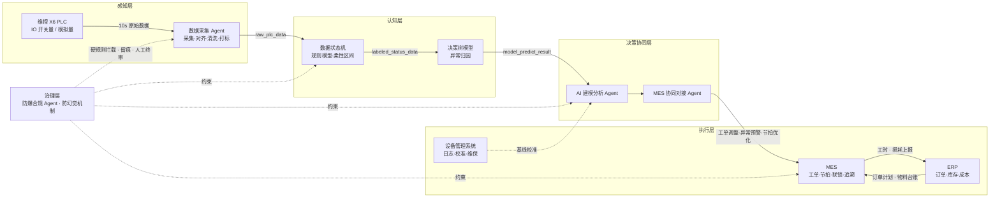
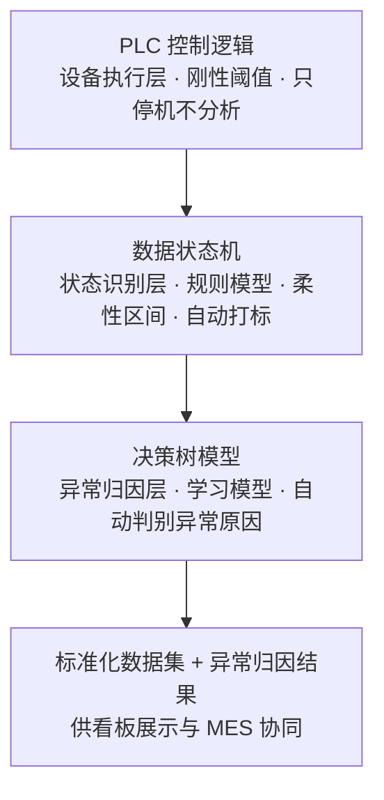
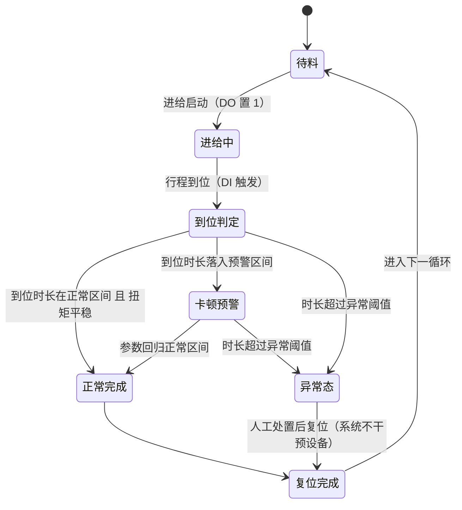
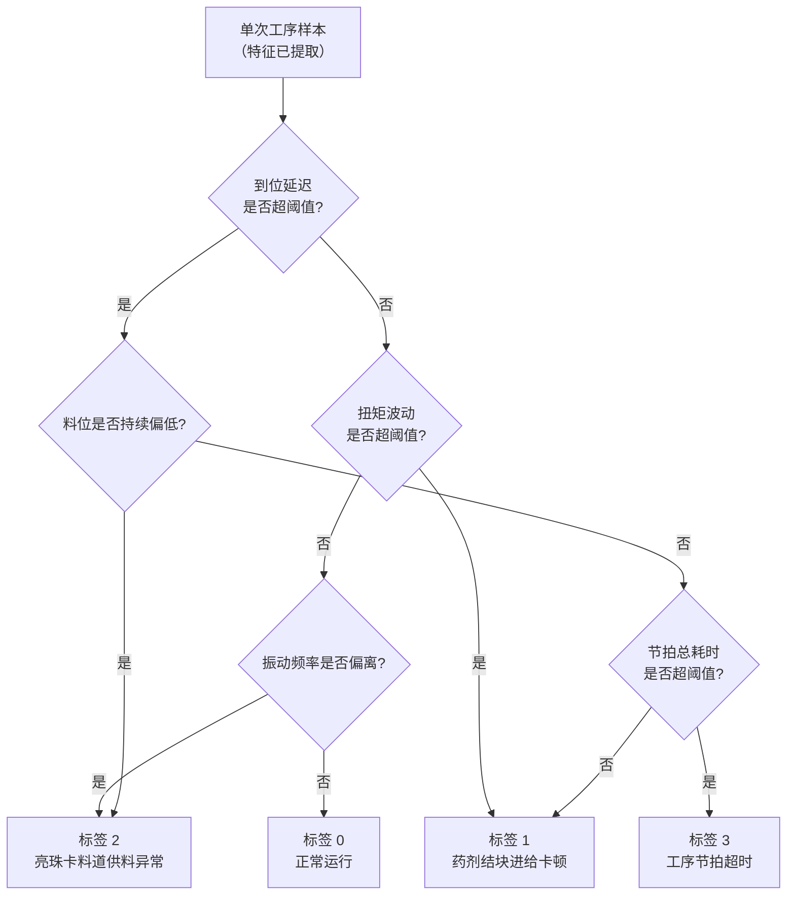
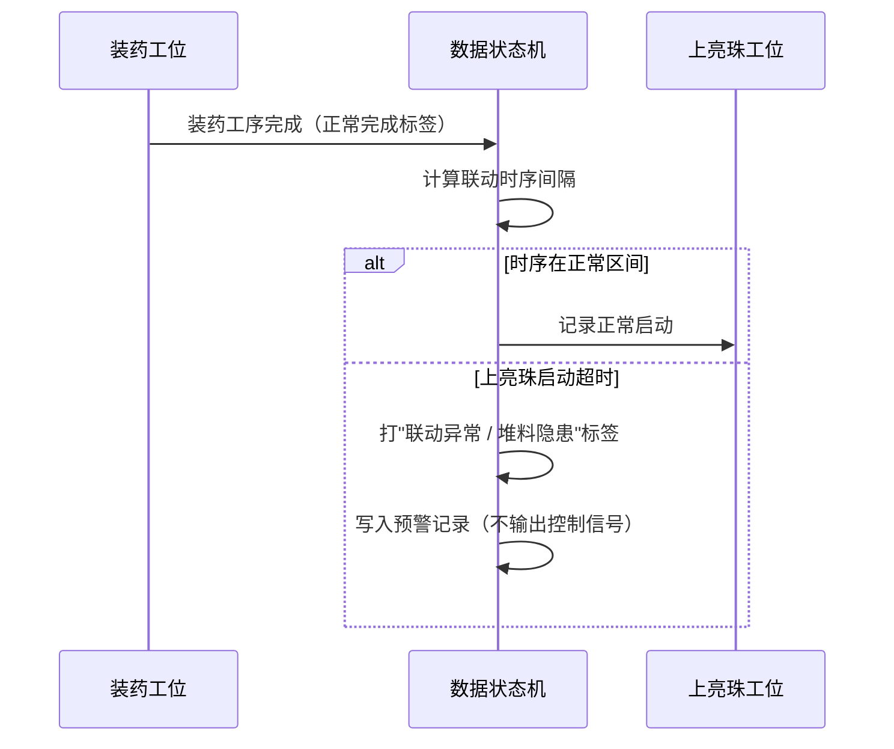
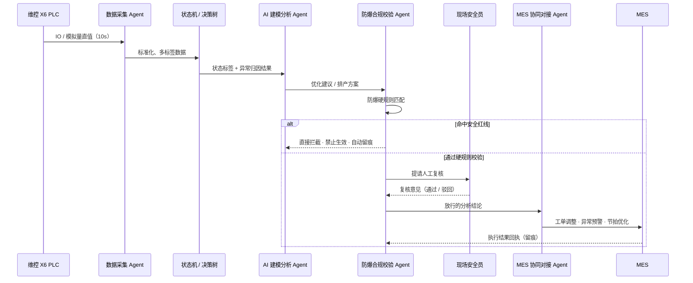
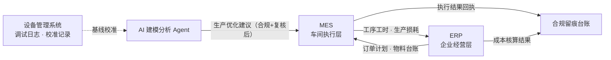
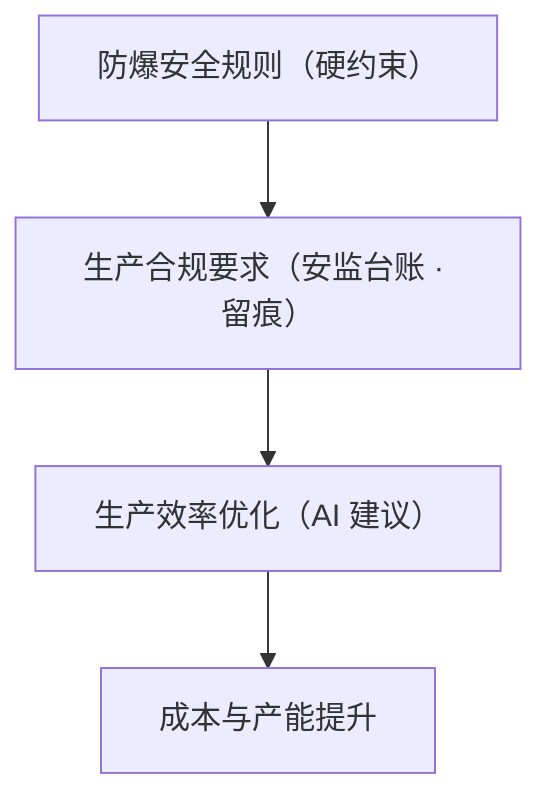
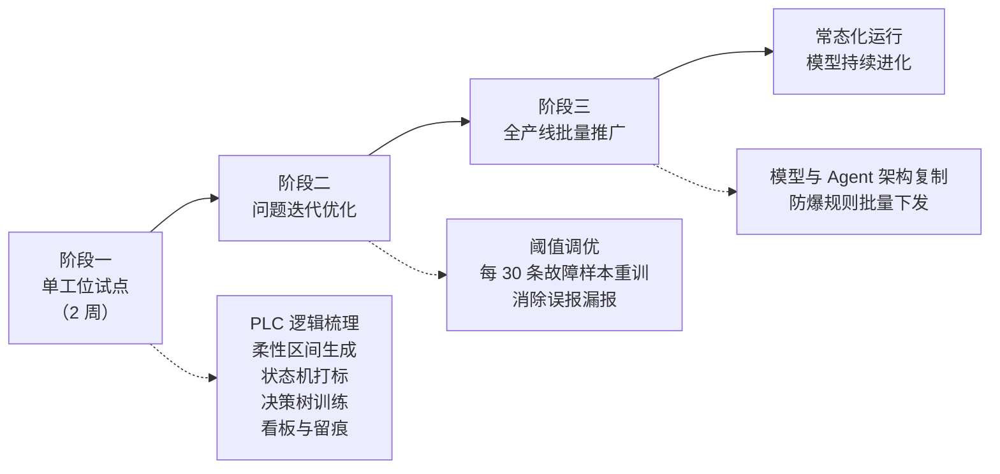

# 烟花产线工业智能体设计方案

> 适用范围：浏阳烟花涉药防爆生产线（0 区 / 1 区涉药工位）
> 文档定位：融合《装药/上亮珠工位联调阶段数据建模落地完整方案》与《AI 智能数据分析与 MES 协同系统落地实施方案（防爆合规版）》，以"工业智能体"为主线重构的分层设计方案
> 版本说明：本方案不替换现有硬件，先单工位试点再全产线推广；所有 AI 逻辑服从烟花防爆安监硬性规范。

---

## 一、方案概述

### 1.1 项目背景

烟花生产线属于易燃易爆高危生产场景，涉药工位（装药、上亮珠、组装等）在人员、药量、温度、设备运行状态上均受安监规范严格约束。当前产线已具备维控 X6 系列 PLC 设备控制能力、MES 生产执行系统与 ERP 企业管理系统，但存在以下共性问题：

1. **数据杂乱、无标准化数据集**：PLC 仅承担设备控制与硬联锁停机，不做数据追溯、不做隐性异常识别，调试阶段数据缺乏统一标准；
2. **分析依赖人工**：隐性异常、参数漂移、节拍劣化只能依靠人工观察，效率低、发现晚；
3. **防爆风险不可控**：AI 或人工的优化建议若突破安全红线，将直接带来涉药安全风险；
4. **安监留痕繁琐**：参数调整、异常处置、报警记录难以形成不可篡改、可直接上报的合规台账。

本方案以"工业智能体"为核心，将**数据建模能力**与**多 Agent 协同能力**融合为一套完整体系，解决从数据采集、状态识别、异常归因到生产协同、合规校验的全链路问题。

### 1.2 现状与前提（核心前提）

本方案的设计严格贴合以下现场事实，不假设不存在的条件：

| 维度 | 现状 |
| --- | --- |
| 现场阶段 | 设备调试 / 联调阶段，**无正式量产数据、无重量检测参数** |
| 可用数据 | PLC 原生 IO 开关量、传感器模拟量（扭矩、行程、料位、振动频率等）直值 |
| 数据资产 | 仅实时采集直值，**无人工标注、无异常数据集、无分析模型** |
| 设备能力 | PLC 仅做设备控制与硬联锁停机，无数据追溯、无隐性异常识别、无工位联动分析 |
| 信息化基础 | 已具备 MES、ERP、设备管理系统，以及 Node-RED / PostgreSQL / Grafana 等既有现场数据链路 |

> **建模核心原则：不改动现场 PLC 程序、不干预设备运行，纯数据侧镜像建模**，适配防爆区设备调试规则。

### 1.3 建设目标

1. **建数据底座**：把杂乱的调试原始数据，转化为带状态标签、可追溯、可复用的标准化数据集；
2. **建认知能力**：让系统能够自动判断"设备处于什么状态、是否异常、异常是什么原因"；
3. **建协同体系**：以多 Agent 分工协作，把分析结果转化为 MES 可执行的生产协同与预警；
4. **建合规闭环**：让所有 AI 输出受防爆硬规则约束、全程留痕、人工终审，满足安监上报要求。

### 1.4 核心设计原则

1. **零风险优先**：不修改现场 PLC、不干预设备运行，所有超阈值行为只记录、预警、存数据，不输出控制信号；
2. **安全高于效率**：防爆安全规则的优先级高于一切效率优化，AI 无权修改、无权突破安全红线；
3. **零硬件改造**：完全依托现有 PLC、MES、ERP、设备系统与现场信息化资源，硬件零成本投入；
4. **权责不冗余**：明确 MES 执行层与 ERP 经营层边界，杜绝重复开发与功能冗余；
5. **可解释、可迭代**：模型选型以工业稳定、可解释、少样本适配为准则，随数据积累持续进化；
6. **人工终审兜底**：涉安全、涉生产调整的 AI 输出，必须经现场安全员复核后方可落地。

### 1.5 关键术语界定

本方案涉及三组极易混淆的概念，先作明确界定，全篇术语保持一致。

#### （1）PLC 程序 vs 数据状态机

| 对比项 | PLC 程序 | 数据状态机 |
| --- | --- | --- |
| 层级定位 | 设备**控制层** | 数据**观测层** |
| 逻辑特性 | 硬逻辑、固定阈值 | 复刻 PLC 动作逻辑、柔性浮动区间 |
| 行为 | 负责停机联锁、执行控制 | 只记录、只预警，**不控制设备** |
| 历史 | 不存历史、不做分析 | 可追溯、可联动、可识别隐性故障 |
| 关系 | — | 状态机是 PLC 的**数据镜像升级版**，不是重复造轮子 |

#### （2）状态机 vs 决策树模型

| 对比项 | 数据状态机 | 决策树模型 |
| --- | --- | --- |
| 模型类型 | **规则模型** | **AI 学习模型** |
| 判断能力 | 判断"是否异常、处于什么状态" | 判断"异常是什么原因"，实现自动归因 |
| 数据角色 | 产出标准化带标签数据集 | 消费数据集、学习规律 |
| 依赖 | 人工梳理的设备逻辑 | 状态机产出的数据集 |

#### （3）MES vs ERP

| 系统 | 核心层级 | 核心功能 | 数据边界 |
| --- | --- | --- | --- |
| ERP | 企业经营层 | 订单管理、采购库存、财务核算、总账统计 | 管**总量、成本、订单计划**，不参与车间现场细节管控 |
| MES | 车间执行层 | 设备工时记录、工序节拍、现场异常、防爆联锁、批次追溯 | 管**现场每一秒的执行数据**，只服务生产与安全，不做薪资、财务核算 |

---

## 二、总体设计

### 2.1 设计思路

本方案以"工业智能体"为主线，采用**统一数据池 + 多角色 Agent 分工协作**架构，无复杂中间件，基于现有 MySQL 数据库搭建共享数据中台，所有数据、指令、分析结果在体系内闭环流转。

整体按"融"与"分"两条线展开：

- **融**：把原有两份方案的能力合并——数据状态机与决策树归入智能体的"感知与认知底座"；四大 Agent 作为"智能体运行框架"；MES/ERP 协同与防爆合规作为"执行与治理边界"。
- **分**：按五层递进结构清晰划分职责，每层明确输入、输出与边界，避免功能交叉。

### 2.2 五层架构

整个工业智能体由自下而上、层层递进的五个层次构成：

1. **感知层**：对接现场维控 X6 PLC，完成全工序 IO 数据、设备运行参数、工位状态的实时采集、对齐、清洗与打标，形成统一数据底座。
2. **认知层**：以 PLC 顺控逻辑为骨架搭建数据状态机，用柔性区间替代固定阈值自动打标；再以轻量决策树模型实现异常归因。
3. **决策协同层**：由 AI 建模分析 Agent 与 MES 协同对接 Agent 承担——动态优化阈值、输出生产优化建议，并将其转化为 MES 可执行指令。
4. **执行层**：MES 承接现场执行级协同，ERP 承接经营级数据，设备管理系统提供基线校准支撑。
5. **治理层**：防爆合规校验 Agent 与防幻觉机制横向贯穿全层，对感知、认知、决策、执行全过程施加安全约束与合规留痕。

### 2.3 总体架构图

### 2.4 端到端数据流

数据自现场产生到结果落地，形成单向下行、结果回流的闭环：

**流转说明**：

1. PLC 原始数据以 10s 时间戳粒度持续落库至 `raw_plc_data`；
2. 数据状态机实时读取原始数据，自动打状态标签，写入 `labeled_status_data`；
3. 决策树模型对打标数据实时推理异常类型，结果写入 `model_predict_result`；
4. 看板与 MES 协同 Agent 读取结果表，形成预警、追溯与生产协同指令；
5. 治理层对全链路施加硬规则拦截、不可篡改留痕与人工终审。

### 2.5 角色与职责边界

| 层次 | 承担角色 | 输入 | 输出 | 边界 |
| --- | --- | --- | --- | --- |
| 感知层 | 数据采集 Agent | PLC IO / 模拟量直值 | 标准化、多标签原始数据 | 只采集清洗，不做分析判断 |
| 认知层 | 数据状态机 + 决策树 | 原始数据、调试正常批次 | 状态标签、异常归因结果 | 只记录预警，不输出控制信号 |
| 决策协同层 | 建模分析 Agent + MES 协同 Agent | 打标数据集、工业知识 | 优化建议、MES 可执行指令 | 建议受治理层约束，不直接改设备 |
| 执行层 | MES / ERP / 设备系统 | AI 结果与人工终审意见 | 工单、节拍、追溯、成本数据 | MES 管现场执行，ERP 管经营总量 |
| 治理层 | 防爆合规 Agent + 防幻觉机制 | 全链路数据与 AI 输出 | 拦截、留痕、合规台账 | 最高优先级，AI 无权突破 |

---

## 三、感知层：数据采集与数据底座

### 3.1 定位与职责

数据采集 Agent 是整个工业智能体的"眼与耳"，位于架构最底层，承担把现场物理信号转化为可用数据资产的职责：

1. **对接现场设备**：对接现场维控 X6 系列 PLC，自动完成全工序 IO 数据、设备运行参数、工位状态的实时采集、对齐、清洗；
2. **自动打标签**：自动为数据打上防爆区域标签、工序标签、药剂批次标签、设备状态标签；
3. **统一入库**：剔除异常脏数据，统一数据格式，存入共享数据中台；
4. **不做判断**：感知层只负责"采得准、存得全、标得清"，异常识别与归因交由认知层完成。

**支撑资源**：现场 PLC 点表、PLC 官方 SDK 开发手册、设备传感器校准记录、产线工位区域划分文档。

### 3.2 采集范围与点位类型

| 点位类型 | 说明 | 典型示例 | 采集粒度 |
| --- | --- | --- | --- |
| DI 数字量输入 | 设备到位、限位、门锁等状态信号 | 行程到位、安全门闭合 | 10s 时间戳粒度 |
| DO 数字量输出 | 设备动作指令回读 | 进给启动、振动筛启动 | 10s 时间戳粒度 |
| AI 模拟量 | 传感器连续量测值 | 伺服扭矩、进给行程、料位、振动频率 | 10s 时间戳粒度 |
| 工位状态 | 工位级运行 / 暂停 / 停机状态 | 急停、暂停、检修 | 状态变化即录 |
| 环境数据 | 防爆区环境量测 | 温度、湿度 | 10s 时间戳粒度 |

**首批覆盖工位**：装药工位、上亮珠工位（优先涉爆核心工位）。**可扩展工位**：供料机（M2）、上纸片机（M12）、内外筒组合机（M13）、振动摇匀机、提升机、旋转 / 单向传送带、悬吊运输线、安全门等，均可复用同一套采集与标签体系。

### 3.3 数据清洗、对齐与脏数据处理

1. **时间对齐**：多源点位按 10s 时间窗口统一对齐，消除 PLC 扫描周期与传输延迟造成的时序错位；
2. **格式统一**：点位命名、量纲、精度按点表规范统一，避免同义异名；
3. **脏数据识别**：识别空值、连续跳变、重复值、越量程值、时间戳乱序等；
4. **脏数据不丢弃原始值**：标记为"异常数据"后保留原始行，另以标记列区分，保证可追溯、可复核；
5. **补采机制**：对断点、丢包时段做时序补采与还原，保证数据连续性（可复用既有 Node-RED → PostgreSQL 采集链路与"按秒还原"能力）。

### 3.4 多标签体系

为保证数据可分析、可追溯、可合规上报，每条数据在入库时同步打上四类标签：

| 标签类别 | 作用 | 取值示例 |
| --- | --- | --- |
| 防爆区域标签 | 区隔 0 区 / 1 区 / 非防爆区，支撑红区锁定与跨区管控 | 0 区、1 区、非防爆区 |
| 工序标签 | 标识数据所属工序，支撑工序级基线与分析 | 装药、上亮珠、组装 |
| 药剂批次标签 | 关联批次，支撑批次追溯与跨批次阈值适配 | 批次号 |
| 设备状态标签 | 标识设备当前运行状态 | 待料、运行、暂停、停机 |

### 3.5 单库数据中台与三张核心表

数据中台采用**单数据库、多表单架构**（MySQL 单实例即可），无需多库部署，轻量化适配调试阶段，同时作为四大 Agent 的共享数据池。

#### （1）原始数据表 `raw_plc_data`

存储 PLC 全部采集原始数据，10s 时间戳粒度，调试全过程持续写入。

| 字段 | 说明 |
| --- | --- |
| id | 自增主键 |
| ts | 时间戳（10s 粒度） |
| station | 工位（装药 / 上亮珠） |
| di_* / do_* | 各 DI / DO 点位值 |
| ai_* | 传感器模拟量值（扭矩、行程、料位、振动频率等） |
| zone | 防爆区域标签 |
| batch | 药剂批次标签 |

#### （2）打标数据集表 `labeled_status_data`（建模核心样本库）

由状态机自动打标生成，是训练 AI 模型的唯一数据源。

| 字段 | 说明 |
| --- | --- |
| id | 自增主键 |
| raw_id | 关联原始数据 ID |
| ts | 时间戳 |
| station | 工位 |
| status_label | **设备运行状态标签** |
| delay_time / torque / material_level / vib_freq … | 运行参数特征 |
| is_abnormal | 是否异常 |
| fault_label | 异常分类标签（人工复核后回填） |

#### （3）模型结果表 `model_predict_result`（展示 / 预警用）

存储 AI 模型识别结果，用于看板展示、异常追溯与 MES 协同。

| 字段 | 说明 |
| --- | --- |
| id | 自增主键 |
| ts | 时间戳 |
| station | 工位 |
| status | 设备状态 |
| fault_type | 异常类型 |
| confidence | 置信度 |
| warning_level | 预警等级 |
| trace_id | 溯源标识（绑定原始数据行号） |

### 3.6 数据质量保障

1. **完整性**：统计采集完整率，对缺口时段自动补采；
2. **一致性**：入库前校验字段类型、量纲与标签合法性；
3. **可追溯**：任意结果均可通过 `trace_id` 回溯至原始数据行；
4. **只增不改**：原始数据与打标数据一经写入不允许原地修改，修正以新增记录方式表达，保证审计可信。

---

## 四、认知层：状态机与异常归因

### 4.1 建模总体思路

认知层是工业智能体的"大脑"，采用三层递进建模：

**关键区别**：

- PLC：固定阈值、超时直接停机（刚性控制）；
- 状态机：复制动作顺序，**不控制设备**，仅做数据观测；
- 决策树：消费状态机产出的数据集，学习并输出异常原因。

### 4.2 PLC 逻辑镜像与柔性区间

#### 第一步：提取 PLC 程序逻辑，搭建模型骨架

打开维控 X6 PLC 程序，拆解**装药、上亮珠**两个工位的完整顺控步序，记录每一步的触发条件、IO 点位、额定动作时长、传感器标准数值，标准化固定动作流程（设备标准循环）：

- **装药工位**：待料待命 → 进给启动（DO 置 1）→ 行程到位（DI 触发）→ 扭矩稳定 → 复位完成；
- **上亮珠工位**：待料 → 振动筛启动 → 料位稳定供料 → 完成复位。

#### 第二步：基于调试原始数据，生成柔性区间

调试阶段参数存在自然波动，直接使用 PLC 固定阈值会产生大量误报。因此从联调数据中筛选**连续无故障、人工确认正常**的调试批次数据，统计每一步骤的参数波动范围，把 PLC 固定值改为数据区间：

| 参数 | PLC 固定设定 | 调试正常波动区间 | 正常 | 预警 | 异常 |
| --- | --- | --- | --- | --- | --- |
| 进给到位时间 | 1.5s | 1.2s ~ 1.8s | 1.2 ~ 1.8s | 1.8 ~ 2.0s | > 2.0s |
| 伺服扭矩 | 固定值 | 统计区间 | 区间内 | 区间外 ±10% | 区间外 ±10% 以上 |
| 料位值 | 固定值 | 统计区间 | 区间内 | 区间外 | 持续偏离 / 突变 |
| 振动频率 | 50Hz | 统计区间 | 区间内 | 区间外 | 持续偏离 |

> 柔性区间是"数据侧镜像建模"的核心：既保留 PLC 的动作逻辑骨架，又适配调试阶段的真实波动，避免误报。

### 4.3 数据状态机（第一层模型）

**状态机作用**：给每一条 PLC 原始数据**自动打状态标签**，生成结构化数据集。可识别状态包括：待料、进给中、供料中、正常完成、进给超时、料位异常、卡顿预警。

#### 状态机核心规则

1. **严格按 PLC 动作时序判断**，不打乱设备工序逻辑；
2. 所有超阈值行为**只记录、预警、存数据，不输出控制信号**；
3. **实现工位联动判断**：装药工序完成后，判定上亮珠启动时序是否正常，识别堆料隐患；
4. **持续运行**，自动给原始数据打标签，写入 `labeled_status_data` 表。

#### 状态流转

> 此时产出：**第一套可用、带状态标签的现场真实数据集**，是后续 AI 建模的唯一数据源。

### 4.4 决策树异常归因模型（第二层模型）

状态机只能判断"正常 / 异常"，决策树可以**自动识别异常原因**。无需深度学习、无需海量数据，适配调试阶段少样本场景。

#### （1）特征选取（模型输入）

从数据集中提取核心有效特征：

- 进给到位延迟时长；
- 装药伺服扭矩均值 / 波动值；
- 上亮珠振动筛频率；
- 料位传感器波动差值；
- 工序循环总耗时。

#### （2）标签选取（模型输出）

由人工结合现场调试记录，对异常数据打分类标签：

| 标签 | 含义 |
| --- | --- |
| 0 | 正常运行 |
| 1 | 药剂结块进给卡顿 |
| 2 | 亮珠卡料道供料异常 |
| 3 | 工序节拍超时 |

#### （3）模型选择与约束

- 采用轻量决策树模型，**最大深度限制为 4**，防止过拟合、适配少量样本；
- 选型理由：工业场景最稳定、**可解释**（决策路径可人工核验，规避"黑箱 + 幻觉"风险）、无算力压力；
- 评估：以准确率为基础指标，辅以各异常类别召回情况，避免"少数类被淹没"；
- 输出：异常类型标签 + 置信度，写入 `model_predict_result` 表。

#### （4）归因决策逻辑示意

> 上述为可解释的逻辑示意，实际分支由训练得到的决策树给出，但每条判定路径均可回溯到具体特征与阈值。

### 4.5 工位联动与隐性异常识别

烟花产线各工位存在严格的前后置关系，单工位正常不代表整线正常。状态机在单工位判断之上，增加**工位联动判断**能力：

**联动判断价值**：识别"装药完成后上亮珠未及时启动"导致的上亮珠前段堆料隐患——这类隐性异常在单工位视角下难以察觉，也是 PLC 刚性控制难以覆盖的场景。

### 4.6 模型迭代机制（联调 → 量产过渡）

1. **样本驱动迭代**：持续积累异常样本，每积累 **30 条真实故障数据**重新训练模型，提升准确率；
2. **基线固化**：设备量产、满负荷生产后，用正式班次数据替换调试柔性区间，固化生产基线；
3. **阈值调优**：逐步优化阈值，消除误报、漏报；
4. **版本管理**：模型与阈值配置版本化，任一历史版本可追溯、可回滚。

---

## 五、决策协同层：四 Agent 协同框架

### 5.1 架构总览

整套系统采用**统一数据池 + 四角色 AI Agent 分工协作**架构，无复杂中间件，基于现有 MySQL 数据库搭建共享数据中台，所有数据、指令、分析结果闭环流转。四个 Agent 分属不同层次，各司其职、边界清晰：

| Agent | 所属层次 | 核心职责 | 主要输出 |
| --- | --- | --- | --- |
| 数据采集 Agent | 感知层 | 采集、对齐、清洗、多标签打标 | 标准化原始数据 |
| AI 建模分析 Agent | 决策协同层 | 基线生成、异常识别、阈值优化、优化建议 | 分析结论、优化建议 |
| MES 协同对接 Agent | 决策协同层 | 打通 AI 引擎与 MES，结果转指令，记录执行级数据 | MES 可执行指令 |
| 防爆合规校验 Agent | 治理层 | 硬规则拦截、全程留痕、安监适配、人工复核兜底 | 合规结论、安监台账 |

> 数据采集 Agent 的详细设计见第三章，防爆合规校验 Agent 的治理规则见第七章，本章重点阐述决策协同层的两个 Agent 及其协作机制。

### 5.2 AI 建模分析 Agent（核心算法层）

#### 核心职责

1. 基于产线**无故障标准生产班次数据**，自动生成各工序（装药、亮珠上料、组装等）的生产参数基线；
2. 搭建轻量时序数据模型、决策树模型，自动识别药量偏差、设备卡顿、参数漂移等产线异常；
3. 动态优化参数阈值，适配不同药剂批次、不同生产工况，输出生产优化建议。

#### 支撑资源

历史正常生产数据集、设备调试日志、各工序标准作业参数文档。

#### 关键约束

- 分析结论必须可溯源至原始 PLC 数据行，不允许脱离数据"自由发挥"；
- 阈值调整建议属于敏感输出，必须经防爆合规校验 Agent 与人工复核后方可生效；
- 模型可解释性优先于精度，确保每条建议都能被现场人员理解与验证。

### 5.3 MES 协同对接 Agent（业务执行层）

#### 核心职责

1. 打通 AI 分析引擎与 MES 生产系统的数据接口；
2. 将 AI 产出的异常预警、节拍优化、产能分析结果，转化为 MES 可执行的工单调整、设备预警、生产节拍优化指令；
3. 记录设备工时、工序作业时长、单批次生产损耗等**现场执行级数据**。

#### 关键约束

- 只做"分析结果 → 可执行指令"的翻译与投递，不越权直接操作设备；
- 指令下达前必须携带合规校验通过标识与人工复核标识；
- 现场执行级数据仅服务于产线效率分析、损耗统计与安监追溯，**不替代 ERP 人事薪资与财务核算**。

### 5.4 防爆合规校验 Agent（安全风控层）

#### 核心职责（方案核心亮点）

1. **硬规则拦截**：所有 AI 优化建议、排产方案、参数调整，必须严格匹配烟花防爆安全生产规范，超药量、超温、超员、超设备运行阈值的 AI 结果**直接拦截，禁止生效**；
2. **全程留痕溯源**：所有数据修改、AI 分析结论、异常处置记录，自动加盖不可篡改时间戳、工位防爆区域标识、操作人员信息；
3. **安监自动适配**：按照《AQ 4101-2026 烟花爆竹安全生产风险监测预警规范》，自动生成合规安监台账报表；
4. **人工复核兜底**：所有涉防爆 AI 输出结果，必须经现场安全员人工复核后，方可同步至生产系统。

### 5.5 Agent 协作流程

四个 Agent 以"采集 → 认知 → 分析 → 合规 → 执行"的顺序协作，合规校验作为强制闸门内嵌于流程之中：

**流程要点**：

1. AI 的任何输出都无法绕过合规校验直接到达 MES；
2. 命中安全红线时流程立即终止并留痕，不进入人工复核环节；
3. 人工复核通过后方可下发，执行结果需回执留痕，形成完整证据链。

### 5.6 AI 防幻觉四重机制

彻底解决 AI 虚假数据、虚假分析、违规建议问题，采用四重锁死机制：

| 机制 | 具体措施 | 解决的问题 |
| --- | --- | --- |
| **数据源锁死** | 所有 AI 仅可读取指定内网 MySQL 数据库、官方 SDK 文档、内部 ERP / MES / 设备台账，禁止调用任何外部网络数据 | 杜绝外部不可信信息污染 |
| **安全规则硬拦截** | 防爆、安监、生产红线规则写入系统底层，AI 无权修改、无权突破 | 杜绝违规建议落地 |
| **结果溯源机制** | 每一条 AI 分析结论、优化建议，自动绑定原始 PLC 数据行号、台账来源、时间戳，可一键溯源核验 | 杜绝无依据结论 |
| **人工终审机制** | 涉安全、生产调整的所有 AI 输出，必须安全员复核，方可落地执行 | 兜底防幻觉风险 |

---

## 六、执行层：业务系统协同

整套系统完全依托厂家现有信息化资源，杜绝重复开发、功能冗余，实现 ERP、MES、设备系统三方闭环。

### 6.1 现有系统资源复用总览

| 系统 | 可复用资源 | 对智能体的价值 |
| --- | --- | --- |
| ERP | BOM 物料台账、库存 / 采购数据、财务总账数据 | 提供合规生产基准、支撑动态排产、接收成本核算数据 |
| MES | 设备工时、工序节拍、现场异常、防爆联锁、批次追溯 | 承接 AI 协同指令，输出现场执行级数据 |
| 设备管理系统 | PLC 调试日志、传感器校准记录、设备维保台账 | 为 AI 模型提供基线校准支撑 |

### 6.2 ERP 系统可复用资源

1. **BOM 物料台账**：烟花药剂、原材料批次、配比标准，为 AI 建模提供合规生产基准；
2. **库存 / 采购数据**：药剂存量、物料领用数据，辅助 AI 动态排产，规避超量生产防爆风险；
3. **财务总账数据**：接收 MES 同步的工序工时、生产损耗数据，用于生产成本核算。

### 6.3 MES 系统定位（与 ERP 严格划界，无功能重复）

| 系统 | 核心层级 | 核心功能 | 数据边界 |
| --- | --- | --- | --- |
| ERP | 企业经营层 | 订单管理、采购库存、财务核算、总账统计 | 管**总量、成本、订单计划**，不参与车间现场细节管控 |
| MES | 车间执行层 | 设备工时记录、工序节拍、现场异常、防爆联锁、批次追溯 | 管**现场每一秒的执行数据**，只服务生产与安全，不做薪资、财务核算 |

#### 重点说明

MES 保留**工序工时、设备运行时长、批次作业量**记录功能，但仅用于产线效率分析、损耗统计、安监追溯，**不替代 ERP 人事薪资、财务核算模块**，两套系统数据单向同步、互不冗余。

### 6.4 设备管理系统可复用资源

PLC 调试日志、传感器校准记录、设备维保台账，用于 AI 模型基线校准，提升数据分析精准度。

### 6.5 数据同步闭环

**同步原则**：

1. **单向同步、互不冗余**：MES → ERP 只上报工时与损耗等经营所需数据，ERP → MES 只下发订单计划与物料台账；
2. **不双向写同一字段**：避免数据打架与责任不清；
3. **全量留痕**：跨系统同步动作同样纳入合规留痕范围，可审计、可追溯。

---

## 七、治理层：防爆安全与合规治理

### 7.1 安全优先级原则

所有 AI 逻辑、数据流转、生产执行，**优先服从防爆安全规则，高于效率优化**，这是系统的最高优先级约束，也是不可被任何配置或指令覆盖的硬性前提。

- 任何一层与上一层冲突时，**无条件服从上一层**；
- AI 无权修改、无权突破防爆安全规则；
- 效率优化在安全边界内进行，不得以效率为由突破红线。

### 7.2 防爆专项硬性落地要求

#### （1）区域隔离管控

系统对烟花产线 0 区、1 区涉药防爆工位做**红区锁定标记**，AI 禁止跨防爆区域调度设备、调配工序，禁止跨区数据随意调用。

#### （2）参数硬阈值联锁

装药剂量、工位温度、设备转速、药剂存量等核心参数设置防爆死阈值，AI 任何优化建议不得突破安全红线；一旦 PLC 实时数据超阈值，自动触发 MES 设备联锁停线。

#### （3）定员定时防爆约束

AI 排产模型自动锁定各防爆工位最大定员、单机最长运行时长，禁止生成违规加班、超员作业的生产计划。

#### （4）全链路合规留痕

所有防爆工位的参数调整、异常报警、人工处置、AI 分析记录，永久存库、不可篡改，自动适配安监上报格式。

### 7.3 防爆合规校验规则矩阵

| 校验维度 | 校验对象 | 拦截条件 | 处置动作 |
| --- | --- | --- | --- |
| 区域 | 设备调度 / 工序调配 | 跨 0 区 / 1 区红区调度 | 直接拦截，禁止生效 |
| 药量 | 装药剂量建议 | 超过防爆死阈值 | 直接拦截，禁止生效 |
| 温度 | 工位温度相关建议 | 超过安全上限 | 直接拦截，禁止生效 |
| 转速 | 设备运行参数建议 | 超过设备安全运行阈值 | 直接拦截，禁止生效 |
| 存量 | 动态排产方案 | 导致药剂超量生产 | 直接拦截，禁止生效 |
| 定员 | 排产 / 班次方案 | 超过工位最大定员 | 直接拦截，禁止生效 |
| 时长 | 排产 / 班次方案 | 超过单机最长运行时长 | 直接拦截，禁止生效 |
| 复核 | 全部涉安全 AI 输出 | 未取得安全员复核意见 | 挂起，禁止下发 MES |

**拦截行为统一规范**：命中任一拦截条件时，系统立即终止该条建议的流转，记录拦截原因、规则编号、原始建议内容、触发时间与责任人，并向建议来源 Agent 回传拦截通知。

### 7.4 合规留痕与安监台账

1. **留痕范围**：数据修改、AI 分析结论、异常报警、人工处置、参数调整、跨系统同步动作，全部纳入留痕；
2. **留痕要素**：不可篡改时间戳、工位防爆区域标识、操作人员 / Agent 标识、原始数据引用；
3. **不可篡改**：写入后不允许原地修改，修正以追加记录方式表达，形成连续证据链；
4. **安监适配**：按照《AQ 4101-2026 烟花爆竹安全生产风险监测预警规范》，自动生成合规安监台账报表，可直接用于安监上报与检查；
5. **留存期限**：不低于安监部门规定的最低年限，且期间内不可删除。

### 7.5 人工终审与责任边界

| 输出类型 | 是否需合规校验 | 是否需人工复核 | 最终责任主体 |
| --- | --- | --- | --- |
| 数据采集与打标结果 | 是 | 否（抽检） | 数据采集 Agent |
| 状态标签 | 是 | 否（抽检） | 状态机 |
| 异常识别与归因结果 | 是 | 否（抽检） | 决策树模型 |
| 参数阈值调整建议 | 是 | **是** | 现场安全员 + 工艺负责人 |
| 排产 / 班次方案 | 是 | **是** | 现场安全员 |
| 涉安全的生产调整 | 是 | **是** | 现场安全员 |

> 人工终审是防爆合规链条的最后一环，AI 不承担安全决策责任，仅提供可解释的分析与建议。

---

## 八、非功能设计

### 8.1 性能设计

| 维度 | 设计目标 | 说明 |
| --- | --- | --- |
| 采集粒度 | 10s 时间戳粒度 | 匹配 PLC 原生 IO / 模拟量特性 |
| 采集端到端延迟 | 秒级 | 满足联调阶段实时观测需求 |
| 状态打标延迟 | 秒级 | 状态机随采集数据流实时处理 |
| 推理延迟 | 秒级 | 决策树模型轻量，单条推理无算力压力 |
| 看板刷新 | 秒级 | 实时设备状态、异常频次、节拍趋势 |
| 并发规模 | 单产线多工位 | 单实例 MySQL 即可承载，无需集群 |

> 设计原则：以"够用、稳定、低算力"为准，不引入不必要的重型组件，降低防爆区部署与运维复杂度。

### 8.2 可靠性设计

1. **采集可靠**：断点续传、缺口补采、时序还原，保证数据连续性；
2. **处理可靠**：状态机与推理过程幂等，重复处理不产生脏数据；
3. **存储可靠**：数据库定期备份，备份可验证、可恢复；
4. **降级策略**：AI 分析链路异常时，PLC 控制与设备联锁不受影响（不干预原则天然保证）；
5. **恢复目标**：RPO ≤ 5 分钟，RTO ≤ 30 分钟。

### 8.3 安全性设计

| 层面 | 措施 |
| --- | --- |
| 网络 | 仅内网访问，AI 禁止调用外部网络数据 |
| 权限 | 分角色授权，AI 与人均受最小权限约束 |
| 数据 | 原始数据与留痕数据只增不改，防篡改 |
| 输出 | 硬规则拦截 + 人工终审双闸门 |
| 审计 | 全链路留痕，可一键溯源核验 |

### 8.4 可扩展性设计

1. **工位可扩展**：采集点表与标签体系与具体工位解耦，新增工位仅需配置点表；
2. **模型可替换**：状态机规则与决策树模型通过配置 / 模型文件管理，可按工位独立迭代；
3. **系统可对接**：MES / ERP 对接通过标准化数据接口，新增系统不改造已有链路；
4. **阈值可配置**：柔性区间与防爆硬阈值均可配置，无需改代码。

### 8.5 可维护性与可观测性

1. **可解释**：决策树路径可人工核验，每个结论均可追溯到特征与阈值；
2. **可观测**：采集状态、打标状态、推理状态、拦截次数、复核队列均在看板可见；
3. **可告警**：采集中断、数据库异常、模型异常、拦截激增等均有告警；
4. **可回溯**：模型版本、阈值版本、配置变更全部留痕，支持回滚。

---

## 九、实施路线

### 9.1 实施总览

实施采用"**小范围试点、迭代后推广**"的轻量化路径，整体节奏与能力建设里程碑对应如下：

| 阶段 | 周期 | 范围 | 能力里程碑 |
| --- | --- | --- | --- |
| 阶段一 单工位试点 | 2 周 | 装药核心涉爆工位 | 数据底座 + 状态机 + 决策树 + 合规闭环全链路跑通 |
| 阶段二 迭代优化 | 持续 | 试点工位 | 阈值调优、规则完善、误报漏报下降 |
| 阶段三 全产线推广 | 分批 | 上亮珠、组装等全部涉爆工位 | 全线智能化升级 |

### 9.2 阶段一：单工位试点（优先装药核心涉爆工位，2 周落地）

1. 完成四大 AI Agent 部署，对接单工位 PLC 数据与内部数据库；
2. 训练单工位生产基线模型，调试防爆拦截规则、防幻觉机制；
3. 打通 MES、ERP 局部数据同步，验证"数据采集 → 分析 → 预警 → 合规留痕"闭环。

**周内节奏建议**：

| 时间 | 工作内容 |
| --- | --- |
| 第 1 周前半 | PLC 顺控逻辑梳理、点表确认、柔性区间初版生成 |
| 第 1 周后半 | 数据采集 Agent 上线，原始数据落库，状态机打标运行 |
| 第 2 周前半 | 决策树模型训练与验证，看板与结果表联调 |
| 第 2 周后半 | 防爆规则与防幻觉机制调试，MES / ERP 局部同步打通，闭环验证 |

### 9.3 阶段二：问题迭代优化

1. 基于试点工位运行数据，优化 AI 模型阈值、合规校验规则、数据同步逻辑，消除系统 BUG 与适配问题；
2. 每积累 30 条真实故障数据重新训练模型，提升准确率；
3. 逐步消除误报、漏报，稳定状态机标签质量。

### 9.4 阶段三：全产线批量推广

将成熟模型、Agent 架构、防爆规则，批量复制至上亮珠、组装等所有涉爆工位，完成全线智能化升级；同时用正式班次数据替换调试柔性区间，固化量产基线。

### 9.5 里程碑与交付物

| 里程碑 | 交付物 |
| --- | --- |
| M1 数据底座可用 | PLC 点表与标签规范、数据采集 Agent、`raw_plc_data` 表、采集链路 |
| M2 状态机可用 | 柔性区间配置、状态机规则、`labeled_status_data` 表 |
| M3 认知模型可用 | 决策树模型文件 `plc_fault_model`、`model_predict_result` 表、准确率评估报告 |
| M4 协同与合规可用 | 四 Agent 协同流程、防爆规则库、人工复核队列、安监台账模板 |
| M5 可视化可用 | 实时状态看板、异常频次、工序节拍趋势、合规留痕查询 |
| M6 全线上线 | 全线工位模型与规则、验收报告、运维手册 |

### 9.6 风险与对策

| 风险 | 潜在影响 | 对策 |
| --- | --- | --- |
| 调试阶段样本少，模型欠拟合 | 异常识别率低 | 柔性区间 + 决策树限制深度 + 人工复核兜底 |
| 参数自然波动大 | 误报干扰现场 | 持续统计正常批次分布，动态调优区间 |
| 人工标注主观偏差 | 训练标签质量不稳定 | 制定标注规范，多人交叉确认 |
| 数据链路中断 | 数据缺口、时序断裂 | 断点补采、时序还原、链路告警 |
| AI 建议越权 | 涉药安全风险 | 硬规则拦截 + 人工终审双闸门 |
| 跨系统权责不清 | 重复开发、数据打架 | MES / ERP 边界矩阵，单向同步 |
| 现场人员接受度低 | 推行受阻 | 试点先行、展示可见收益、配套培训 |

### 9.7 验收指标

| 类别 | 指标 | 目标值 |
| --- | --- | --- |
| 数据 | 采集完整率 | ≥ 99.5% |
| 数据 | 时间对齐成功率 | ≥ 99% |
| 认知 | 状态打标准确率（人工抽检） | ≥ 95% |
| 认知 | 异常识别准确率（试点期） | ≥ 90%，随样本积累持续提升 |
| 认知 | 异常误报率 | ≤ 5% |
| 认知 | 工位联动隐性异常 | 可识别并预警 |
| 协同 | AI 输出人工复核率 | 100% |
| 合规 | 合规留痕覆盖率 | 100% |
| 合规 | 硬规则拦截漏拦率 | 0 |
| 系统 | 可用性 | ≥ 99% |
| 安全 | 对 PLC / 设备的干预次数 | 0（不改动、不干预） |

---

## 十、附录

### 附录 A：数据库对象清单

| 对象 | 类型 | 作用 | 关键字段 |
| --- | --- | --- | --- |
| `raw_plc_data` | 表 | 原始数据实时落库 | ts、station、di_* / do_*、ai_*、zone、batch |
| `labeled_status_data` | 表 | 建模核心样本库，唯一训练数据源 | raw_id、ts、station、status_label、delay_time、torque、material_level、vib_freq、is_abnormal、fault_label |
| `model_predict_result` | 表 | 展示与预警输出 | ts、station、status、fault_type、confidence、warning_level、trace_id |

**索引建议**：三表均按 `ts + station` 建立联合索引，支撑时间范围查询与工位筛选；`labeled_status_data.fault_label`、`model_predict_result.fault_type` 建立辅助索引，支撑异常统计。

### 附录 B：核心算法逻辑简述（不含完整代码）

**运行环境依赖（简述）**：Python 运行环境，配套数据处理、数据库驱动、机器学习与模型持久化等常规工业级库即可，无 GPU、无重型算力需求。

**训练流程逻辑**：

1. 从 `labeled_status_data` 读取已打标结构化数据；
2. 拆分特征列（到位延迟、扭矩、料位、振动频率等）与标签列；
3. 划分训练集与测试集；
4. 训练决策树分类模型，**限制最大深度为 4**；
5. 评估准确率并输出评估报告；
6. 持久化模型文件，供实时推理调用。

**推理流程逻辑**：

1. 加载模型文件；
2. 接收单条工序特征向量 `[到位延迟, 扭矩, 料位, 振动频率]`；
3. 输出标签并映射为可读异常类型（正常 / 药剂结块卡顿 / 亮珠卡料 / 节拍超时）；
4. 结合置信度生成预警等级，写入 `model_predict_result` 表，供看板与 MES 协同使用。

**状态机逻辑要点（规则，非学习）**：

1. 按 PLC 顺控步序定义状态与迁移条件；
2. 迁移判据使用柔性区间（正常 / 预警 / 异常三段）；
3. 任何超阈值行为仅记录与预警，**不产生控制输出**；
4. 每个状态迁移点输出一条打标记录。

### 附录 C：术语表

| 术语 | 含义 |
| --- | --- |
| 工业智能体（Industrial AI Agent） | 由感知、认知、决策协同、执行、治理五层构成，能自主完成数据采集、状态识别、异常归因与协同决策的产线智能系统 |
| PLC | 可编程逻辑控制器，负责设备控制与硬联锁停机（控制层） |
| 数据状态机 | 复刻 PLC 动作逻辑的数据观测模型，使用柔性区间，只记录不控制（观测层） |
| 柔性区间 | 由调试正常数据统计得到的参数波动范围，替代 PLC 固定阈值 |
| 决策树模型 | 轻量可解释的监督学习模型，用于异常归因 |
| 防幻觉四重机制 | 数据源锁死、安全规则硬拦截、结果溯源、人工终审 |
| 红区锁定 | 对 0 区 / 1 区涉药防爆工位的强管控标记，禁止跨区调度与数据随意调用 |
| 全链路留痕 | 对数据修改、AI 结论、异常处置、参数调整的不可篡改记录 |

### 附录 D：参考资料

1. 《烟花生产线（装药 / 上亮珠工位）联调阶段数据建模落地完整方案》——本方案感知层与认知层的主要来源；
2. 《烟花生产线 AI 智能数据分析与 MES 协同系统落地实施方案（防爆合规版）》——本方案决策协同层、执行层与治理层的主要来源；
3. 《AQ 4101-2026 烟花爆竹安全生产风险监测预警规范》——防爆合规校验与安监台账适配依据；
4. 现场资料：维控 X6 PLC 点表与官方 SDK 开发手册、设备传感器校准记录、产线工位区域划分文档、设备维保台账；
5. 李文军. 基于数字孪生的数控机床加工状态监测方法研究[J]. 现代制造技术与装备, 2026, 62(9): 95-97+101.

---

> 说明：本方案由既有两份落地文档融合重构而成，技术事实与约束条件均来源于原始资料；文中未标注的量测目标值（如准确率、完整率等）为工程建议目标，需在试点阶段结合实际数据校准确定。

